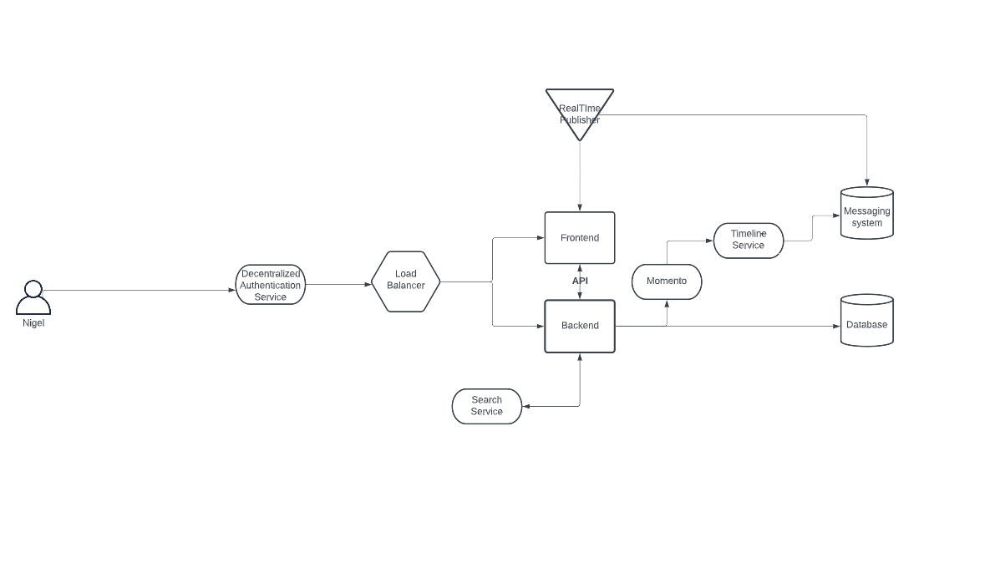
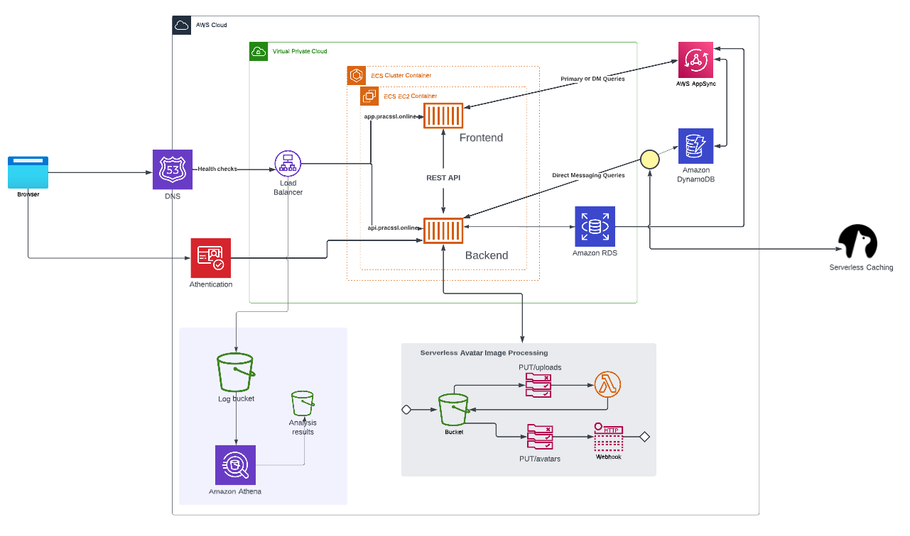
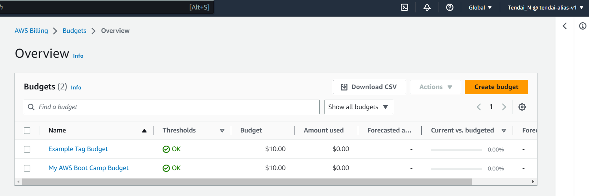
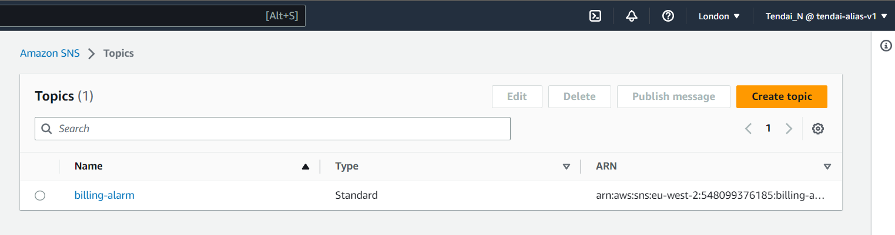

# Week 0 — Billing and Architecture

## Required Homework

### Installed AWS CLI and ensured that it works:

Gitpod, and the yml file contains the items and instructions uused to set it up each time I open up the Gitpod workspace, making use of stored environment variables.
[Set up CLI on Gitpod](.gitpod.yml)

```yml
tasks:
  - name: aws-cli
    env:
      AWS_CLI_AUTO_PROMPT: on-partial
    init: |
      cd /workspace
      curl "https://awscli.amazonaws.com/awscli-exe-linux-x86_64.zip" -o "awscliv2.zip"
      unzip awscliv2.zip
      sudo ./aws/install
      cd $THEIA_WORKSPACE_ROOT

```

### Created the Conceptual(Napkin Design) Diagram for the Cruddur App:
Recreated the Cruddur napkin design diagram using Lucid Chart



[Cruddur COnceptual Diagram](https://lucid.app/lucidchart/ca6b84a0-ce91-44dd-a334-ca4799cc3ef3/edit?viewport_loc=-824%2C-530%2C3072%2C1493%2C0_0&invitationId=inv_c2bd2bfb-180a-4f2b-a278-ba5f84f58901)

### Recreate Logical diagrams using Lucid Chart with an additional item
 Added 2 extra buckets to store logs from the load balancer, which can then be analyzed later on using Athena, reason being to analyze the health of the ECS containers, how much traffic is going through to the containers and if there was any downtime, the logs would help determine this.
 


[Lucid Charts Share link](https://lucid.app/lucidchart/3471ac0b-47e4-468b-b495-b85520e06ae9/edit?viewport_loc=631%2C43%2C3413%2C1658%2C0_0&invitationId=inv_243342d3-2dd9-4735-8b88-0c3af7c960aa)

### Created a Budget

For this task, I created 2 monthly Budgets for $10 each, just to stay within what I can afford at the moment:).


## Billing Alarm SNS topic

The SNS topic for this alarm was created using a json file following cli commands whilst storing the json contents in a json file on Gitpot



```json

{
    "AlarmName": "DailyEstimatedCharges",
    "AlarmDescription": "This alarm would be triggered if the daily estimated charges exceeds 1$",
    "ActionsEnabled": true,
    "AlarmActions": [
        "arn:aws:sns:eu-west-2:548099376185:billing-alarm"
    ],
    "EvaluationPeriods": 1,
    "DatapointsToAlarm": 1,
    "Threshold": 1,
    "ComparisonOperator": "GreaterThanOrEqualToThreshold",
    "TreatMissingData": "breaching",
    "Metrics": [{
        "Id": "m1",
        "MetricStat": {
            "Metric": {
                "Namespace": "AWS/Billing",
                "MetricName": "EstimatedCharges",
                "Dimensions": [{
                    "Name": "Currency",
                    "Value": "USD"
                }]
            },
            "Period": 86400,
            "Stat": "Maximum"
        },
        "ReturnData": false
    },
    {
        "Id": "e1",
        "Expression": "IF(RATE(m1)>0,RATE(m1)*86400,0)",
        "Label": "DailyEstimatedCharges",
        "ReturnData": true
    }]
  }
```

